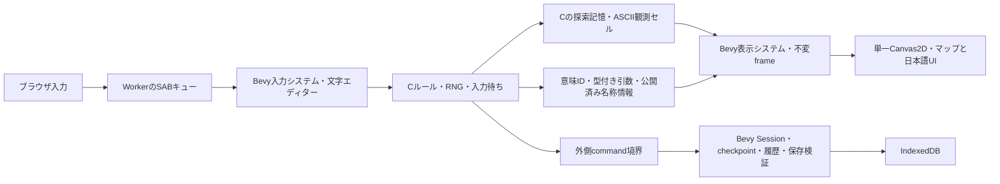

# Rogueの4層と日本語化

RRP Rogue 5.4.4のCロジックをBevy 0.19.1を使うRust/Wasmの表示・入力・プラットフォームへ接続した。取得原本55ファイル、取得archive、既存Brogueを変更せず、隔離した実装コピーで作業した。

## 境界

描画からCルールへ戻る更新経路はない。CゲームスタックはWorker内で同期実行し、入力だけAtomics.waitで待つ。新規ゲームと復元は新しいWorker/Wasm instanceを作る。Asyncifyは使わない。

| 処理 | 実ファイル・関数 |
|---|---|
| ゲーム開始・終了 | logic/core.c rg_core_start/rg_core_exit、Rust rg_run |
| command・ターン | logic/command.c command、daemon.c do_daemons/do_fuses |
| 観測と描画 | logic/knowledge.c rg_knowledge_present、Rust rg_host_present |
| 意味メッセージ | logic/message.c rg_message_prepare/rg_message_flush、semantic.c rg_semantic_argument、Rust rg_host_message |
| 状態・設定・ヘルプ・一覧・結末 | C rg_ui_line/rg_ui_printf、Rust rg_host_ui、presentation.rs / game_window.rs |
| 文字入力 | logic/options.c get_str/strucpy、Rust rg_host_text_mode/rg_host_read_key/rg_host_player_name |
| 保存・復元 | logic/state.c、save_adapter.c、Rust rg_host_checkpoint/rg_host_restore_data/platform::Envelope |

ABIは固定幅整数と借用byte列を使う。CのunionやWINDOW、FILE、callback pointerは境界を渡さない。保存allocationはCの対応freeで解放する。

## Cargoクレート

RustはCargo workspace内の独立クレートに分ける。`rogue-display`（`rust/crates/display/`）は翻訳・画面構造・地図の観測キャッシュ・足元・フレーム生成、`rogue-input`（`rust/crates/input/`）はキー変換・UTF-8編集・持ち物操作の状態、`rogue-platform`（`rust/crates/platform/`）は保存検証・checkpoint・入力journal・再生状態を所有する。3クレートはBevyに依存し、それぞれのPluginがResource・Component・Systemを登録する。C/JSのFFIは接続用クレートに限定し、3クレートではunsafeを禁止する。

共有の生成済みABI定数は `rogue-contract`（`rust/crates/contract/src/abi.rs`）に置く。同クレートの `runtime.rs` はBevyのSystemSetと確定キーを伝えるJournalPort Resourceを定義する。入力は表示の公開descriptor・選択ポリシーを参照する一方向の依存とし、表示は入力に依存しない。プラットフォームはBevy・共通契約・serdeを使い、表示・入力には依存しない。持ち物の描画は表示の `inventory.rs`、選択・予約は入力の `inventory.rs` が担当し、描画には `InventoryView` を渡す。

既存の `rogue-layers` はこれらを接続するstaticlibを作る。`lib.rs` にC/JSの境界、`session.rs` に初期化データと各層のResourceへの借用ビュー、`engine.rs` にBevy App・実行順序とクレート間の状態投影を残す。実際の状態は各クレートが定義するResourceとComponentに分けて保持する。`layer-check`・`entity-check`・`engine-check` も実際のクレートを参照する。各層の単体テストは `tools/run-clean.ps1 cargo test --offline --locked --manifest-path rust/Cargo.toml --workspace --exclude rogue-layers --lib` で実行できる。

## Bevy ランタイム

`rust/src/engine.rs` は実際の `bevy::App` を所有する。DefaultPlugins、winit、WGPU、TimePlugin は使わず、ブラウザの Worker と Canvas2D に接続する3つの Plugin を登録する。

| Plugin | Resource / Entity とシステム |
| --- | --- |
| RogueDisplayPlugin（rogue-display） | GameWindowView と ObservedMap の Entity。翻訳済みウインドウ、直前のマップ、表示効果、不変フレームを生成・保持する。 |
| RogueInputPlugin（rogue-input） | State と InputPort Resource。ウインドウ内のキーと Unicode scalar を原 C の byte/キーへ変換し、journal確定後に文字編集と持ち物操作へ反映する。 |
| RoguePlatformPlugin（rogue-platform） | Session・JournalPort・SavePort Resource。実際に消費したキーをjournalへ記録し、checkpointと入力履歴から既存形式の保存envelopeを作る。 |

C の同期入力待ち・表示・保存の FFI 呼出しに合わせて App.update() を呼ぶ。システムの順序は Presentation → Input → Journal → AcceptedInput → Frame → Save に固定し、単一スレッドで実行する。時間経過だけで C のコマンドを実行せず、描画のために C の乱数を呼ばない。保存済みキーは以前と同じ経路で C に再生し、再変換しない。新規セッションでは App/World を作り直し、ウインドウとマップのキャッシュを消す。

原 C のルール・RNG・FFI ABI・保存形式は維持する。ブラウザの再描画はキャッシュだけを使う。フレームの `engine` フィールドで Bevy の版と Canvas2D バックエンドを観測できるが、この診断情報をゲーム画面に表示しない。

## 日本語表示

全ゲーム本文は意味IDと引数をC呼出し時点で捕捉する。動的な品名・怪物名には、元の表示経路で選ばれた外見や数量をdescriptorとして添える。RustがEN/JAカタログと語形から文章を構成する。翻訳のためにRNGを再実行したり、未鑑定の効果・未公開の能力を参照したりしない。

6系統のカタログはゲーム本文277、ゲームUI137、名称408と語形35、runtime41、結末27、Web UI83の意味IDを含む。系統間で共用する2 IDは内容一致を検査するため、合計を単純なユニークID数として扱わない。catalog再生成でも既存意味IDを保つ。

ゲーム操作は **Rust ゲームウインドウ → Rust 入力 → C 本体 → Rust 表示** の順で処理する。`game_window.rs` がウインドウの種類・翻訳済みタイトル・操作キーを定義し、`rogue-input` が物理入力を C のキーへ変換する。`rg_host_read_key` は入力待ちの直前に Rust の表示を通知する。C の品物選択は公開済みの所持品 descriptor を `choices` として渡し、Rust が選択ボタンに変換する。Canvas2D は Rust の表示データを描画し、当たり判定とフォーカスから既存の入力経路へ送信する。

`rogue-input` の `inventory.rs` は Bevy の Session に保持する持ち物メニューの状態を扱う。C の `i` は公開済み descriptor の一覧を渡して閉じる入力を待ち、Rust は選択・詳細・戻るを `Input::View` として再表示する。表示だけの入力は C の journal に記録しない。確定した操作は C のコマンド待ちへ渡し、その後の対象入力で候補キーを照合して渡す。投げる方向は通常の移動入力を使い、杖の方向、指輪を着ける際の手、命名・識別の追加入力は C のウインドウで受ける。対象入力の前に失敗したり取消した場合は予約を破棄する。

投げる C コマンドの実行範囲を表示専用の `throw_direction` scope で通知する。Rust はこの scope と方向入力待ちを合わせて `ui.movement_direction` を作り、専用ウインドウを出さない。Canvas は通常のマップとスマホの方向ボタンを表示し、キャンセル以外の操作ボタンと待機を無効にする。Rust は方向待ちに限って Shift/Ctrl の移動入力を一方向へ変換し、C の get_dir へ渡す。実際の方向決定・混乱による乱数・投射・回数指定・繰り返しは C の処理を保持する。コマンドの観測情報なので、回数付きの t や保存の再生でも表示を判断できる。

保存 envelope v2 の presentation.input にメニュー対応の印と、方向待ちの対象だけを保持し、C の保存バイト列や乱数状態は変更しない。メニュー途中のロードは一覧から再開する。旧版の入力履歴にある `i` は従来の C 一覧で再生し、保存地点を越えた新しい `i` から操作メニューを使う。表示する詳細は descriptor の visible_fields に従い、未鑑定の which・呪い・強化値を読み出さない。

可視表示はweb/canvas-ui.jsによる単一のCanvas2Dへ集約する。マップ、トップ、メッセージ、状態、名前、一覧、ヘルプ、設定、死亡・勝利・得点、操作ボタン、文字入力欄を描く。透明なネイティブinputでIME・編集・クリップボードを扱い、値・選択範囲・カーソルをCanvasへ描く。読み上げ用HTMLと非表示のHTMLボタン・フォームは置かず、Canvas操作から直接処理を呼ぶ。一覧の文字幅・折り返し・スクロールが元のMoreやターンを増減させることはない。持ち物・ヘルプ・ゲーム内設定・結果表示中は Rust が直前の観測済みマップを保持し、ゲーム画面内のウインドウの背後へ描く。品物・方向・左右の手・確認・文字入力も同じウインドウ層を使う。Space 待ちのウインドウでは Enter/Esc を C が期待する Space へ変換し、消費したキーを journal に記録する。保存済みキーの再生は再変換しない。比較用のraw cellsは原Cが生成した英語・ASCII観測として別に保つ。

原作の英語冠詞・複数形・printf幅はカタログmetadataで扱い、必要な場合だけ理由を付けて省略する。戦闘断片はactor・target・verbを使って日本語の語順へ組み直す。自由な名前やfruit、命名に含まれる%等はデータとして保持し、printfとして再解釈しない。

欠落ID、未登録descriptor、未翻訳UIはmissing_ids/fallback_usedへ残す。実行した日本語シナリオはこれらを0として検証する。静的coverageのdynamic呼出し19件は、動的descriptor経路の存在を表すもので、未訳19件を意味しない。

## UTF-8と名前

開始名はUTF-8で49バイトまで、原作get_strの名前・命名は50バイトまで。Cはゲームの英語知識画面にASCII aliasまたは安全なplaceholderを保持し、実際のUTF-8 identityをRustから表示する。get_strのmultibyte編集はUnicode scalar単位、ctypeはunsigned byte、長さ境界はUTF-8途中を切らない。

通常コマンドは従来のASCIIキーのみ。Cが明示した文字入力状態でだけブラウザのUnicode scalarをUTF-8 byteへ変換する。文字入力時のDELはCのerasechar()==8へ正規化してからjournalへ記録する。名前編集を空のEnterで終えた場合、元C名がaliasでも実名を保持する。結合文字や複合絵文字全体を一度に消す書記素編集は専用実装していない。

## 保存

CのRG4SAVEは論理schema2、探索記憶RGKN、実行・待ち状態RGRTをsection別に保存する。Rust envelope v2はソースhash、ABI、上限、checksum、UI構造を検証し、UTF-8の入力byteと意味ID付きpresentationを保存する。入力途中の草稿はCへ渡して保存し、Enterによる確定をしない。

外側command境界のcheckpointと、その後に実際に読まれた入力を新しいmoduleで再生する。C stackそのものを保存せず、More、アイテム選択、加速中の別移動枠、日本語編集中の待ち位置を再現する。メッセージ履歴は意味ID・引数で保存し、再開時に翻訳する。

旧Web envelope v1には当時の意味付きUI履歴がない。構造検証とルール状態の復元は可能だが、過去メッセージの完全な日本語復元は保証しない。旧端末save互換は実装していない。IndexedDBはbrowser originごとの保存、ランキングは現在のセッション内だけである。

## ルール比較と安全性

元BEFORE/AFTER、haste、sleep、free command、run/count、waste_timeを維持する。lookのwake/gazeや幻覚、戦闘文のRNGはC側に残す。32bit wrapを明示し、基準版では元式を-fwrapvで比較する。元のdaemon13callbackの型をWasmへ適合させ、登録先と呼出し引数を照合した。

基準版は取得原本から生成し、観測・隔離platform・保存とWasm型適合を共用する。原33C中21Cが同一、静的監査34項目で元本文との関係を確認する。製品は33C中17Cが同一、新アダプター5Cを加えた38Cである。差分とhashはtests/baseline-source-audit.jsonとtests/split-provenance.jsonに記録する。

20語の論理state/RNG、全raw英語frame、入力読み取り位置を比較する。双方が共用するadapterの誤りは比較だけでは検出できない。実端末ncurses・全seed・全展開との網羅的互換を保証しない。元のlabel aliasや%再表示等の未定義動作は、壊れる原本を動かして一致させず製品の安全性試験として扱う。

過去の実測の件数と対象ビルドSHA-256の説明はtests/RESULTS-ja.mdを参照する。検証JSON、ログ、詳細出力は2026-10-10の整理で削除済みで、現在のビルドを確認する場合は必要な試験を再実行する。異なる粒度の検査を合算してゲーム互換保証の件数にしない。

スマホ専用操作、ゲームパッド、永続ランキング、公開配布、実端末対応は今回の範囲外。日本語カタログは本実装へ接続済みであり、各分岐の実測範囲は保存した検証資料に明示する。

Space 待ちの表示は実際の遷移に合わせて「閉じる」「次のページ」「次の品物」「結果を見る」に分ける。C は `rg_wait_for` で意味を観測として公開し、Rust がウインドウ・ボタン・キー変換を作る。C の待つキーとロジックは保持する。1行ずつの所持品では Enter は送り、Esc は C の取消分岐へ渡す。検出結果は C の描画済みセルからウインドウ内のマップを表示する。全経路の調査とブラウザー検証は [SPACE-WAITS-ja.md](SPACE-WAITS-ja.md) を参照。
