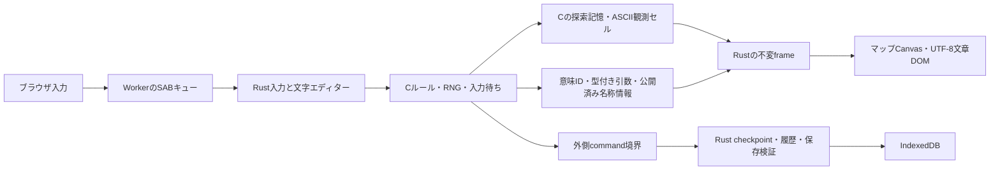

# Rogueの4層と日本語化

RRP Rogue 5.4.4のCロジックをRust/Wasmの表示・入力・プラットフォームへ接続した。取得原本55ファイル、取得archive、既存Brogueを変更せず、隔離した実装コピーで作業した。

## 境界

描画からCルールへ戻る更新経路はない。CゲームスタックはWorker内で同期実行し、入力だけAtomics.waitで待つ。新規ゲームと復元は新しいWorker/Wasm instanceを作る。Asyncifyは使わない。

| 処理 | 実ファイル・関数 |
|---|---|
| ゲーム開始・終了 | logic/core.c rg_core_start/rg_core_exit、Rust rg_run |
| command・ターン | logic/command.c command、daemon.c do_daemons/do_fuses |
| 観測と描画 | logic/knowledge.c rg_knowledge_present、Rust rg_host_present |
| 意味メッセージ | logic/message.c rg_message_prepare/rg_message_flush、semantic.c rg_semantic_argument、Rust rg_host_message |
| 状態・設定・ヘルプ・一覧・結末 | C rg_ui_line/rg_ui_printf、Rust rg_host_ui、presentation.rs |
| 文字入力 | logic/options.c get_str/strucpy、Rust rg_host_text_mode/rg_host_read_key/rg_host_player_name |
| 保存・復元 | logic/state.c、save_adapter.c、Rust rg_host_checkpoint/rg_host_restore_data/platform::Envelope |

ABIは固定幅整数と借用byte列を使う。CのunionやWINDOW、FILE、callback pointerは境界を渡さない。保存allocationはCの対応freeで解放する。

## 日本語表示

全ゲーム本文は意味IDと引数をC呼出し時点で捕捉する。動的な品名・怪物名には、元の表示経路で選ばれた外見や数量をdescriptorとして添える。RustがEN/JAカタログと語形から文章を構成する。翻訳のためにRNGを再実行したり、未鑑定の効果・未公開の能力を参照したりしない。

6系統のカタログはゲーム本文277、ゲームUI137、名称408と語形35、runtime41、結末27、Web UI83の意味IDを含む。系統間で共用する2 IDは内容一致を検査するため、合計を単純なユニークID数として扱わない。catalog再生成でも既存意味IDを保つ。

日本語のCanvasはマップ用ASCIIセルだけを描く。メッセージ、状態、名前、一覧、ヘルプ、設定、死亡・勝利・得点はUTF-8のDOMに表示する。一覧の文字幅・折り返し・スクロールが元のMoreやターンを増減させることはない。比較用のraw cellsは原Cが生成した英語・ASCII観測として別に保つ。

原作の英語冠詞・複数形・printf幅はカタログmetadataで扱い、必要な場合だけ理由を付けて省略する。戦闘断片はactor・target・verbを使って日本語の語順へ組み直す。自由な名前やfruit、命名に含まれる%等はデータとして保持し、printfとして再解釈しない。

欠落ID、未登録descriptor、未翻訳UIはmissing_ids/fallback_usedへ残す。実行した日本語シナリオはこれらを0として検証する。静的coverageのdynamic呼出し19件は、動的descriptor経路の存在を表すもので、未訳19件を意味しない。

## UTF-8と名前

開始名はUTF-8で49バイトまで、原作get_strの名前・命名は50バイトまで。Cはゲームの英語知識画面にASCII aliasまたは安全なplaceholderを保持し、実際のUTF-8 identityをRustから表示する。get_strのmultibyte編集はUnicode scalar単位、ctypeはunsigned byte、長さ境界はUTF-8途中を切らない。

通常コマンドは従来のASCIIキーのみ。Cが明示した文字入力状態でだけブラウザのUnicode scalarをUTF-8 byteへ変換する。文字入力時のDELはCのerasechar()==8へ正規化してからjournalへ記録する。名前編集を空のEnterで終えた場合、元C名がaliasでも実名を保持する。結合文字や複合絵文字全体を一度に消す書記素編集は専用実装していない。

## 保存

CのRG4SAVEは論理schema2、探索記憶RGKN、実行・待ち状態RGRTをsection別に保存する。Rust envelope v2はソースhash、ABI、上限、checksum、UI構造を検証し、UTF-8の入力byteと意味ID付きpresentationを保存する。入力途中の草稿はCへ渡して保存し、Enterによる確定をしない。

外側command境界のcheckpointと、その後に実際に読まれた入力を新しいmoduleで再生する。C stackそのものを保存せず、More、アイテム選択、加速中の別移動枠、日本語編集中の待ち位置を再現する。メッセージ履歴は意味ID・引数で保存し、再開時に翻訳する。

旧Web envelope v1には当時の意味付きUI履歴がない。構造検証とルール状態の復元は可能だが、過去メッセージの完全な日本語復元は保証しない。旧端末save互換は実装していない。IndexedDBはbrowser originごとの保存、ランキングは現在のセッション内だけである。

## ルール比較と安全性

元BEFORE/AFTER、haste、sleep、free command、run/count、waste_timeを維持する。lookのwake/gazeや幻覚、戦闘文のRNGはC側に残す。32bit wrapを明示し、基準版では元式を-fwrapvで比較する。元のdaemon13callbackの型をWasmへ適合させ、登録先と呼出し引数を照合した。

基準版は取得原本から生成し、観測・隔離platform・保存とWasm型適合を共用する。原33C中21Cが同一、静的監査34項目で元本文との関係を確認する。製品は33C中17Cが同一、新アダプター5Cを加えた38Cである。差分とhashはtests/baseline-source-audit.jsonとtests/split-provenance.jsonに記録する。

20語の論理state/RNG、全raw英語frame、入力読み取り位置を比較する。双方が共用するadapterの誤りは比較だけでは検出できない。実端末ncurses・全seed・全展開との網羅的互換を保証しない。元のlabel aliasや%再表示等の未定義動作は、壊れる原本を動かして一致させず製品の安全性試験として扱う。

過去の実測の件数と対象ビルドSHA-256の説明はtests/RESULTS-ja.mdを参照する。検証JSON、ログ、詳細出力は2026-10-10の整理で削除済みで、現在のビルドを確認する場合は必要な試験を再実行する。異なる粒度の検査を合算してゲーム互換保証の件数にしない。

スマホ専用操作、ゲームパッド、永続ランキング、公開配布、実端末対応は今回の範囲外。日本語カタログは本実装へ接続済みであり、各分岐の実測範囲は保存した検証資料に明示する。
